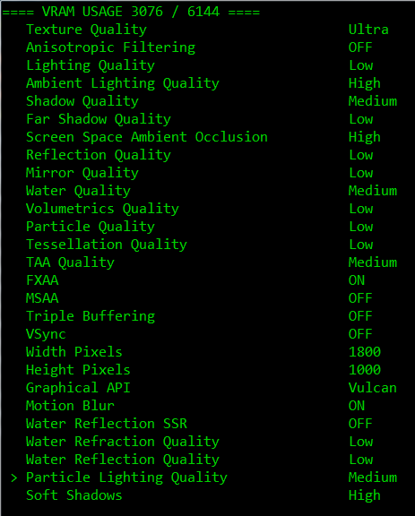

## Neat settings selector for RDR2

### Usage
- Make modifications
- Press `Enter` to serialize settings to an `xml` file in current directory
- Video card name will be read if `system.xml` already exists
- Replace existing `system.xml` with the newly generated file

